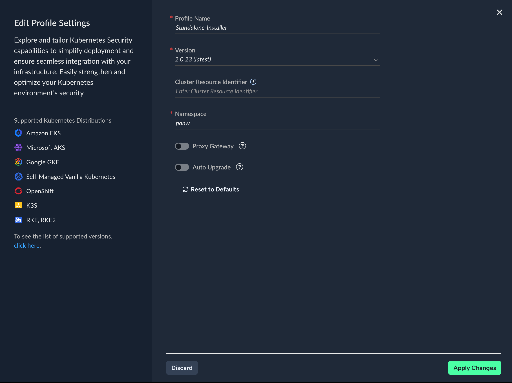
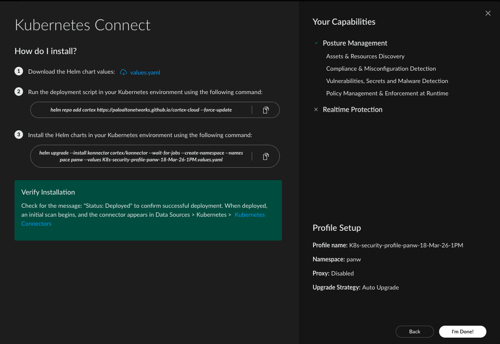
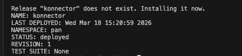

# Kubernetes Connector — Standalone Installer

## Overview

This document provides a step-by-step guide for installing the **Cortex Kubernetes Connector** using the standalone installer.

A standalone installer is designed for customers who need an extra level of control over their environment, including **GitOps control** and **Private Registry support**.

The [`cortex-installer`](cortex-installer) script automates downloading the Helm chart from the Cortex Cloud API, mirroring container images to your private registry, and generating the override values needed for installation.

### How It Works

```
  ┌──────────────┐         ┌──────────────────┐         ┌─────────────────────┐
  │  Your Values  │         │  Cortex Cloud     │         │  Your Private       │
  │  File (.yaml) │────────▶│  Backend API      │────────▶│  Registry           │
  │               │  auth   │  (chart + values) │  mirror │  (mirrored images)  │
  └──────────────┘         └──────────────────┘         └─────────────────────┘
                                    │                             │
                                    ▼                             ▼
                           ┌────────────────┐           ┌────────────────────┐
                           │ Chart .tgz     │           │ cortex-override-   │
                           │ backend-values │           │ values.yaml        │
                           └────────────────┘           └────────────────────┘
                                    │                             │
                                    └──────────┬──────────────────┘
                                               ▼
                                    ┌──────────────────────┐
                                    │  helm upgrade        │
                                    │  --install konnector │
                                    └──────────────────────┘
```

---

## Table of Contents

- [Overview](#overview)
- [Prerequisites](#prerequisites)
- [Download the Script](#download-the-script)
- [Installation Guide](#installation-guide)
  - [Step 1 — Create K8s Installator (Obtain Values File)](#step-1--create-k8s-installator-obtain-values-file)
  - [Step 2 — Download the Chart (`get-chart`)](#step-2--download-the-chart-get-chart)
  - [Step 3 — Mirror Images to Private Registry (Optional)](#step-3--mirror-images-to-private-registry-optional)
  - [Step 4 — Install Kubernetes Connector on your Cluster](#step-4--install-kubernetes-connector-on-your-cluster)
- [Validation](#validation)
- [Command Reference](#command-reference)
- [Uninstalling the Agent](#uninstalling-the-agent)
- [Troubleshooting](#troubleshooting)

---

## Prerequisites

Before using the installer, ensure the following tools are installed on the machine where you will run the script:

| Tool | Minimum Version | Purpose |
|------|-----------------|---------|
| **helm** | v3.8+ | Helm chart installation |
| **docker** | with `buildx` plugin | Pull and push multi-arch container images |
| **curl** | — | Communicate with the Cortex Cloud API |
| **yq** | v4 (mikefarah/yq) | YAML processing |
| **jq** | — | JSON processing |
| **base64** | — | Credential decoding |
| **tar** | — | Chart archive extraction |

> **⚠️ yq version:** Ensure you have the **Go-based** `yq` by Mike Farah, not the older Python-based version. Verify with: `yq --version` — it should show `mikefarah/yq`.

> **Network access:** The machine running this script needs network access to both the Cortex Cloud API and your private registry. The target Kubernetes cluster only needs access to your private registry.

---

## Download the Script

Download the [`cortex-installer`](cortex-installer) script directly from this repository:

```bash
# Download
curl -LO https://raw.githubusercontent.com/PaloAltoNetworks/cortex-cloud/standalone-installer/cortex-installer

# Make executable
chmod +x cortex-installer
```

Or clone this branch:

```bash
git clone -b standalone-installer https://github.com/PaloAltoNetworks/cortex-cloud.git
cd cortex-cloud
chmod +x cortex-installer
```

---

## Installation Guide

### Step 1 — Create K8s Installator (Obtain Values File)

The goal of this step is to create an **Access Key** (Distribution Id) to connect to the tenant.

Navigate to the Cortex Portal to create a new "Kubernetes" Data Source:

**1.** Go to **Settings → Data Sources & Integrations**:


**2.** Then, click on **Kubernetes**:


**3.** Click on **Edit Profile** and apply the following changes:
- **Profile Name:** `Standalone-Installer`
- **Auto Upgrade:** Disabled

Click **Apply Changes** to save the changes.



**4.** Once you have configured the settings, click on **Generate** to create the new installation bundle.

Once the generation is complete, collect the values file and save it securely for future commands.



> **⚠️ Note:** Ignore all other standard commands shown in the wizard, as we have custom commands specifically for the standalone installer.

---

### Step 2 — Download the Chart (`get-chart`)

Make the script executable and download the Helm chart and backend-provided configuration values:

```bash
chmod +x cortex-installer

./cortex-installer get-chart --values <your-values-file.yaml>
```

This command:
- Reads `distribution.id` and `distribution.url` from your values file to authenticate with the Cortex Cloud API
- Downloads the correct Helm chart version for your tenant
- Saves the chart `.tgz` and `backend-values.yaml` to the output directory

**Example:**

```bash
./cortex-installer get-chart --values my-values.yaml
```

**Output:**

```
cortex-mirror-output/
├── konnector-template-<version>.tgz    # Helm chart archive
└── backend-values.yaml                  # Configuration values from backend
```

> **Note:** The chart filename includes the version number (e.g., `konnector-template-1.4.49.tgz`). The exact filename is printed by the script at the end of the command — use that in subsequent steps.

> If you do **not** need a private registry (your cluster can pull from the Cortex registry directly), skip to [Step 4](#step-4--install-kubernetes-connector-on-your-cluster) and use `backend-values.yaml` directly.

---

### Step 3 — Mirror Images to Private Registry (Optional)

Pull all agent container images from the Cortex registry and push them to your private registry.

> **Prerequisite:** You must run `get-chart` first (Step 2).

```bash
./cortex-installer mirror \
  --chart-dir ./cortex-mirror-output \
  --values <your-values-file.yaml> \
  --private-registry <your-registry-url> \
  --docker-pull-secret <base64-encoded-dockerconfigjson>
```

This command:
- Discovers all container images from the chart and backend values
- Authenticates to the Cortex source registry using `dockerPullSecret` and `image.repository` credentials from your values file
- Pulls each image (preserving multi-architecture support: amd64, arm64)
- Pushes all images to your private registry
- Generates `cortex-override-values.yaml` with `image.repository` pointing to your private registry

**Example:**

```bash
# Option A: Pass base64-encoded secret directly
./cortex-installer mirror \
  --chart-dir ./cortex-mirror-output \
  --values my-values.yaml \
  --private-registry myregistry.example.com/cortex/agent \
  --docker-pull-secret <base64-encoded-dockerconfigjson>

# Option B: Pass a Docker config JSON file (recommended — easier to use)
./cortex-installer mirror \
  --chart-dir ./cortex-mirror-output \
  --values my-values.yaml \
  --private-registry myregistry.example.com/cortex/agent \
  --docker-pull-secret-file ./my-docker-config.json
```

> **⚠️ `dockerPullSecret` is required** when using a private registry. The Kubernetes cluster needs this secret to pull images. Provide it using one of:
> - `--docker-pull-secret <base64-encoded-secret>` — pass the base64-encoded Docker config JSON directly
> - `--docker-pull-secret-file <path>` — pass a path to a Docker config JSON file (automatically base64-encoded)
>
> If your cluster already has pre-configured access to the registry (e.g., via a service account or node-level credentials), you can skip this with `--no-pull-secret`.

**Output (added to the output directory):**

```
cortex-mirror-output/
├── konnector-template-<version>.tgz       # Helm chart (from Step 2)
├── backend-values.yaml                     # Backend values (from Step 2)
└── cortex-override-values.yaml             # Generated — use this for installation
```

**Dry run** — Preview what would happen without actually pulling or pushing images:

```bash
./cortex-installer mirror \
  --chart-dir ./cortex-mirror-output \
  --values my-values.yaml \
  --private-registry myregistry.example.com/cortex/agent \
  --docker-pull-secret <base64-encoded-dockerconfigjson> \
  --dry-run
```

> **⚠️ Target registry login:** Ensure you are logged in to your private registry before running the mirror command (`docker login <your-registry>`). If no credentials are found, the script will attempt an **interactive Docker login prompt** — this may block automated/CI pipelines.

> **Re-running:** Running `get-chart` or `mirror` again will overwrite existing files in the output directory.

---

### Step 4 — Install Kubernetes Connector on your Cluster

> **Note:** Before installing, check if the konnector is already installed and remove it if necessary.

**Option A — Direct install (images pulled from Cortex registry):**

Use this when your cluster can pull images directly from the Cortex registry. The `backend-values.yaml` file contains all configuration with `image.repository` pointing to the Cortex source registry.

```bash
helm upgrade --install konnector \
  ./cortex-mirror-output/konnector-template-<version>.tgz \
  --wait-for-jobs \
  --create-namespace \
  --namespace <namespace> \
  --set deployedByLauncher=false \
  --values ./cortex-mirror-output/backend-values.yaml
```

**Option B — Install with private registry (after mirroring):**

Use this when you have mirrored images to your private registry (Step 3). The `cortex-override-values.yaml` file contains all configuration with `image.repository` updated to point to your private registry.

```bash
helm upgrade --install konnector \
  ./cortex-mirror-output/konnector-template-<version>.tgz \
  --wait-for-jobs \
  --create-namespace \
  --namespace <namespace> \
  --set deployedByLauncher=false \
  --values ./cortex-mirror-output/cortex-override-values.yaml
```

> **📋 Copy the exact command from the script output.** Both `get-chart` and `mirror` print the complete `helm` command at the end with the correct chart filename, namespace, and values file path. Copy it directly — no manual editing needed.

> **Note:** The `--set deployedByLauncher=false` flag is required to indicate the agent is being installed manually (not via the Cortex automated launcher).

> **Note:** The namespace (default: `panw`) and chart filename are determined by your tenant configuration. The exact values are printed by the script.

**Expected output on success:**



---

## Validation

After installation, verify the connector is running:

```bash
helm list --namespace <namespace>
kubectl get pods --namespace <namespace>
```

Check for the message `STATUS: deployed` to confirm successful deployment. When deployed, an initial scan begins, and the connector appears in **Data Sources → Kubernetes → Kubernetes Connectors**.

---

## Command Reference

### `get-chart`

Download the Helm chart and values from the Cortex Cloud API.

```
cortex-installer get-chart --values <values-file> [--output-dir <dir>]
```

| Flag | Required | Default | Description |
|------|----------|---------|-------------|
| `--values <file>` | ✅ | — | Path to your Helm values YAML file (must contain `distribution.id`) |
| `--output-dir <dir>` | — | `./cortex-mirror-output` | Directory where artifacts will be saved |
| `-h, --help` | — | — | Show help for this command |

### `mirror`

Mirror container images to a private registry and generate override values.

```
cortex-installer mirror --chart-dir <dir> --values <file> --private-registry <registry> (--docker-pull-secret <secret> | --docker-pull-secret-file <file> | --no-pull-secret) [--dry-run]
```

| Flag | Required | Default | Description |
|------|----------|---------|-------------|
| `--chart-dir <dir>` | ✅ | — | Directory containing `get-chart` output (must have `backend-values.yaml` and chart `.tgz`) |
| `--values <file>` | ✅ | — | Path to your Helm values YAML file (used for `dockerPullSecret` and `image.repository` credentials) |
| `--private-registry <registry>` | ✅ | — | Target private registry URL (e.g., `myregistry.azurecr.io/project/repo`) |
| `--docker-pull-secret <secret>` | — | — | Base64-encoded `dockerPullSecret` for the private registry. Injected into `cortex-override-values.yaml` so the Helm chart can pull images from the private registry. |
| `--docker-pull-secret-file <file>` | — | — | Path to a Docker config JSON file for the private registry. The file is base64-encoded automatically and injected as `dockerPullSecret`. |
| `--no-pull-secret` | — | — | Skip `dockerPullSecret` injection. Use only if your cluster has pre-configured access to the private registry. |
| `--dry-run` | — | `false` | Preview operations without pulling or pushing images |
| `-h, --help` | — | — | Show help for this command |

### Global Options

```
cortex-installer [-h|--help] [-v|--version]
```

| Flag | Description |
|------|-------------|
| `-h, --help` | Show top-level help |
| `-v, --version` | Show script version |

### Environment Variables

These environment variables can be used to customize the script behavior. In most cases, the defaults are correct and no changes are needed.

| Variable | Default | Description |
|----------|---------|-------------|
| `DISTRIBUTION_URL` | *(from your values file's `distribution.url`, or the Cortex distribution service)* | Cortex distribution service URL. Typically auto-detected from your values file. |
| `CH_API` | *(auto-resolved from distribution service)* | Cortex Cloud API URL. Set this to skip automatic resolution. |
| `DOCKER_CONFIG` | `$HOME/.docker` | Path to the Docker configuration directory (for registry credentials). |

---

## Uninstalling the Agent

To remove the Cortex agent from your cluster:

```bash
helm uninstall konnector --namespace <namespace>
```

Replace `<namespace>` with the namespace used during installation (default: `panw`).

---

## Troubleshooting

### "Could not extract `distribution.id`"

Your values file must contain a `distribution.id` field. This is provided in the values file you download from the Cortex console. Verify it exists:

```bash
yq '.distribution.id' <your-values-file.yaml>
```

### "Failed to resolve CH_API from distribution service"

The script cannot reach the Cortex distribution service. Check:
- Network connectivity to the distribution URL
- If behind a proxy, ensure `curl` can reach the endpoint. Set `HTTPS_PROXY` and `NO_PROXY` environment variables as needed.
- You can manually set the `CH_API` environment variable to bypass automatic resolution

### "Values file not found"

Verify the path to your values file is correct. Use an absolute path if running from a different directory:

```bash
./cortex-installer get-chart --values /full/path/to/my-values.yaml
```

### "No chart .tgz found in chart-dir" / "backend-values.yaml not found"

The `mirror` command requires the output from `get-chart`. Ensure you:
1. Ran `get-chart` first
2. Are pointing `--chart-dir` to the correct output directory (default: `./cortex-mirror-output`)

### Docker login failures

- **Source registry:** Credentials are extracted automatically from `dockerPullSecret` in your values file. Ensure this field is present and valid.
- **Target registry:** You must be logged in to your private registry before running `mirror`. Run `docker login <your-registry>` first. If running in a CI pipeline, ensure credentials are configured non-interactively.

### Multi-arch image push failures

The script uses `docker buildx imagetools create` to preserve multi-architecture manifests. If this fails, it falls back to single-architecture `docker tag` + `docker push`. Ensure:
- Docker buildx is installed: `docker buildx version`
- The buildx builder is configured: `docker buildx create --use`

### Wrong `yq` version

If you see YAML parsing errors, you may have the wrong `yq` installed. This script requires the **Go-based** `yq` by Mike Farah:

```bash
# Check your version
yq --version
# Should show: yq (https://github.com/mikefarah/yq/) version v4.x.x

# Install the correct version (macOS)
brew install yq

# Install the correct version (Linux)
# See: https://github.com/mikefarah/yq#install
```

### Viewing logs

Each run creates a log file (path printed at the start of each command). **Log files are preserved only when a command fails** — on success, they are automatically cleaned up. If a command fails, check the log file for detailed diagnostic information:

```
/tmp/cortex-installer-log-XXXXXX.log
```
