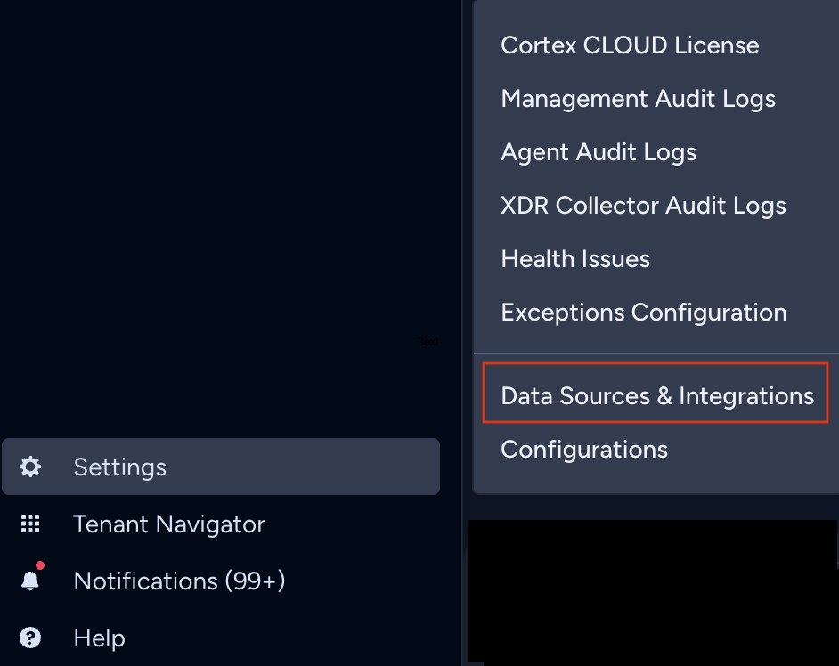
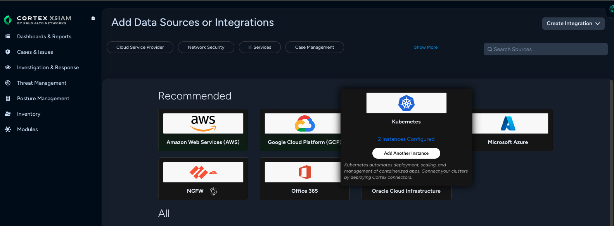
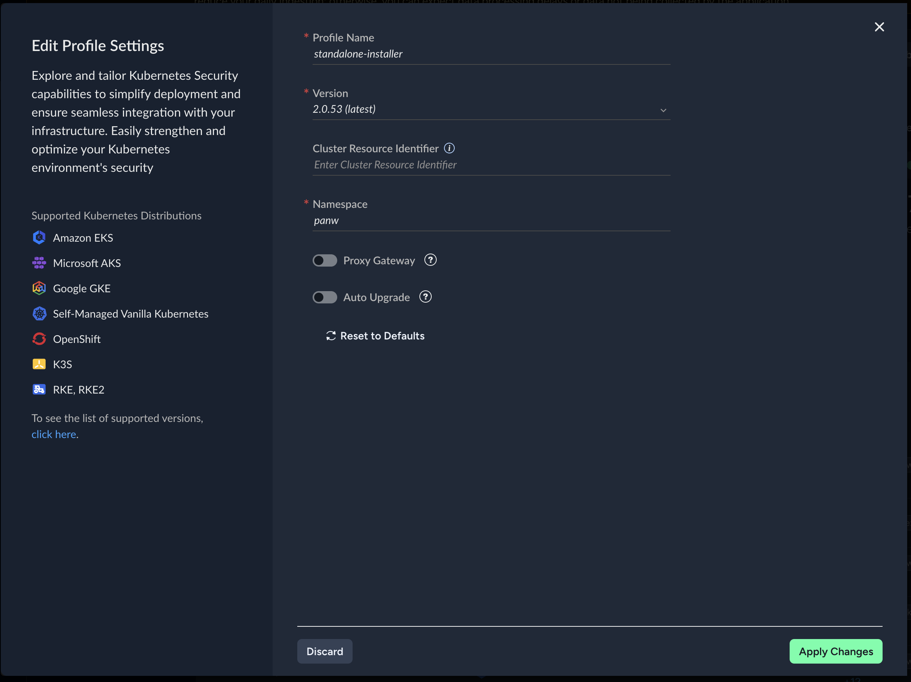
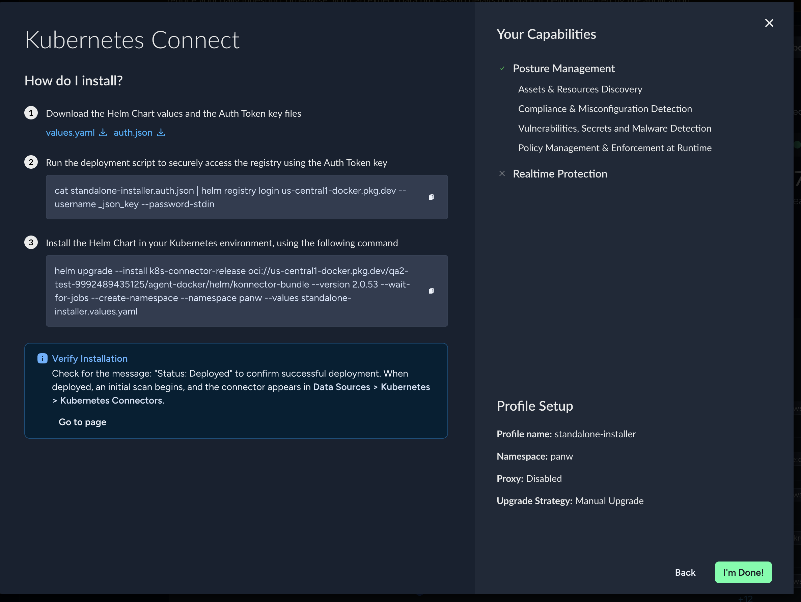

# Cortex Cloud Konnector — Image Mirroring CLI (`kcli`)

`kcli mirror` does three things, in order:

1. **Pulls** every konnector image from the Cortex source registry (multi-arch).
2. **Pushes** them to your private registry.
3. **Rewrites** your `values.yaml` in place (with a timestamped `.bak`) so the chart points at the mirror.

That's it. You then run the portal's unchanged `helm upgrade --install` against the rewritten file. `kcli` never runs `helm install` itself — the portal command stays the source of truth for release name, namespace, and tenant flags, and is frequently delivered through GitOps (Argo CD, Flux).

---

## Quick Start

```bash
# 1. In the Cortex portal, download values.yaml + auth.json. Do NOT run the
#    portal's "helm registry login + helm upgrade --install" block yet.

# 2. Log in to your private (target) registry.
docker login myregistry.azurecr.io

# 3. Mirror images and rewrite values.yaml in place.
kcli mirror \
  --chart-version 2.0.0 \
  --values ./values.yaml \
  --private-registry myregistry.azurecr.io/cortex \
  --docker-pull-secret-file ./pull-secret.dockerconfigjson

# 4. Run the portal's `helm registry login && helm upgrade --install` block,
#    unchanged, against the rewritten values.yaml.
```

Need a kubelet-compatible `pull-secret.dockerconfigjson`? See [Pull Secrets](#pull-secrets-what-kubelet-accepts) — this is the #1 source of `ImagePullBackOff` and you should read it before step 3.

---

## Table of Contents

- [How `kcli` fits with the portal install wizard](#how-kcli-fits-with-the-portal-install-wizard)
- [Prerequisites](#prerequisites)
- [Install](#install)
- [Usage](#usage)
  - [Step 1 — Download the values file](#step-1--download-the-values-file)
  - [Step 2 — Mirror images](#step-2--mirror-images)
  - [Step 3 — Install the konnector](#step-3--install-the-konnector)
- [Pull Secrets: What `kubelet` Accepts](#pull-secrets-what-kubelet-accepts)
- [Command Reference](#command-reference)
- [What `kcli` does NOT do](#what-kcli-does-not-do)
- [Staying Current](#staying-current)
- [Troubleshooting](#troubleshooting)
- [Examples](#examples)
- [License](#license)

---

## How `kcli` fits with the portal install wizard

The Cortex Cloud portal's Kubernetes connect wizard has two sections: **(a)** **Download Configuration Files** (`values.yaml` + `auth.json`), and **(b)** **Run Installation Commands** (a single block pairing `helm registry login` with `helm upgrade --install`).

`kcli` slots in between **(a)** and **(b)**:

| Step | Where it runs | What you do |
|------|---------------|-------------|
| 1. Portal wizard, section (a) | Workstation | Download `values.yaml` / `auth.json` from the portal. **Stop there** — don't run the install commands yet. |
| 2. `kcli mirror` | Workstation with access to both registries | Mirror images to your private registry and rewrite `values.yaml` in place. |
| 3. Portal wizard, section (b) | Cluster admin host (or GitOps) | Run the wizard's `helm registry login` + `helm upgrade --install` block, **unchanged**, against the rewritten values file. |

> `kcli mirror` handles the **source-registry** login itself, using credentials already inside `values.yaml`. You do not need to run the wizard's `helm registry login` before mirroring — only before the install in Step 3.

---

## Prerequisites

| Tool | Minimum Version | Purpose |
|------|-----------------|---------|
| **bash** | 4.0+ | Script runtime (see macOS note below) |
| **docker** | 20.10+ with `buildx` | Pull/push multi-arch images |
| **yq** | v4 (mikefarah/yq) | YAML processing |
| **jq** | 1.6+ | JSON processing |
| **curl** | any recent | Chart download + version check |
| **helm** | 3.8+ | Pull the chart from the source OCI registry (only with `--chart-version`) |
| `tar`, `base64` | POSIX | Bundled with every supported OS |

> **macOS ships bash 3.2.** Install a newer one with `brew install bash` — no shell change needed; `kcli`'s `/usr/bin/env bash` shebang will pick up Homebrew's bash if it's first on `PATH`.

> **yq must be the Go-based mikefarah/yq**, not the Python one. Check with `yq --version`.

> The machine running `kcli` needs access to both the Cortex source registry and your private registry. The cluster only needs access to your private registry.

> `kcli mirror` requires **konnector bundle v2 or higher**. Older bundles are rejected up front.

> Air-gapped? Set `KCLI_SKIP_VERSION_CHECK=1` to skip the upstream version check (see [Staying Current](#staying-current)).

---

## Install

`kcli` is a single self-contained bash script. Pin to a tag for reproducible installs:

```bash
curl -fsSL \
  "https://raw.githubusercontent.com/PaloAltoNetworks/cortex-cloud/main/tools/kcli/kcli" \
  -o /tmp/kcli
sudo install -m 0755 /tmp/kcli /usr/local/bin/kcli
kcli version
```

Or clone the repo and symlink `tools/kcli/kcli` into your `PATH`.

---

## Usage

### Step 1 — Download the values file

In the Cortex Cloud portal, generate an installation bundle and download its files. **You will stop partway through the wizard** — see the [hand-off table](#how-kcli-fits-with-the-portal-install-wizard).

1. **Settings → Data Sources & Integrations**
   
2. Click **Kubernetes**
   
3. **Edit Profile** → set Profile Name `Standalone-Installer`, disable Auto Upgrade, **Apply**
   
4. **Generate**, then in the **Connect Kubernetes** wizard:

   

   - ✅ Download both `values.yaml` and `auth.json` to the workstation where you'll run `kcli`.
   - 🛑 **Do not run** the "Run Installation Commands" block yet — copy it aside for Step 3.

See [`examples/values-example.yaml`](examples/values-example.yaml) for a fully commented template of the portal-issued values file.

---

### Step 2 — Mirror images

Log in to your **target** (private) registry first, then run `kcli mirror`:

```bash
docker login myregistry.azurecr.io

kcli mirror \
  --chart-version 2.0.0 \
  --values ./values.yaml \
  --private-registry myregistry.azurecr.io/cortex \
  --docker-pull-secret-file ./pull-secret.dockerconfigjson
```

`kcli` resolves the chart from `oci://<global.imageRegistry>/helm/konnector-bundle:<version>` (read from your values file) using the credentials already present in `values.yaml`. **You do not need to run the wizard's `helm registry login` for mirroring** — only for the install in Step 3.

If you've already downloaded a chart archive (for example on an air-gapped relay host), pass it instead:

```bash
kcli mirror \
  --chart ./konnector-2.0.0.tgz \
  --values ./values.yaml \
  --private-registry myregistry.azurecr.io/cortex \
  --docker-pull-secret-file ./pull-secret.dockerconfigjson
```

#### What changes in `values.yaml`

`kcli` writes a backup to `<values>.bak.YYYYMMDDTHHMMSSZ` and edits three things:

```diff
 global:
-  imageRegistry: us-central1-docker.pkg.dev/<src-proj>/<src-repo>
+  imageRegistry: myregistry.azurecr.io/cortex
-  dockerPullSecret: <source-registry-creds-b64>
+  dockerPullSecret: <your-private-registry-creds-b64>
   bundle:
     <component>:
       image:
-        repository: <src-repo>/<component>
+        repository: <component>
```

Commit the rewritten file if you're driving installs through GitOps.

#### Providing the pull secret

Exactly **one** of these is required — omitting all three is a hard error (we fail loudly to prevent a silent `ImagePullBackOff` at install time):

| Flag | When to use |
|------|-------------|
| `--docker-pull-secret-file <file>` | You have a `dockerconfigjson` file with **inline** credentials. See [Pull Secrets](#pull-secrets-what-kubelet-accepts). |
| `--docker-pull-secret <base64>` | You already have the secret base64-encoded. |
| `--no-pull-secret` | Cluster pulls without an inline secret. Two sub-cases — pick the right one: |
| &nbsp;&nbsp;• *managed identity* | IRSA, EKS Pod Identity, GKE Workload Identity, AKS Managed Identity — the node/pod auths to the registry implicitly. |
| &nbsp;&nbsp;• *out-of-band secret* | You will create an `imagePullSecret` resource in the cluster yourself (or via GitOps) before installing. **Don't forget this step** — it's the #1 cause of `ImagePullBackOff` when using `--no-pull-secret`. |

> ⚠️ **Do not pass `~/.docker/config.json` blindly.** It often delegates to a keychain or cloud CLI helper, which `kubelet` cannot use. See [Pull Secrets](#pull-secrets-what-kubelet-accepts).

#### Dry run

Preview without pulling/pushing or rewriting:

```bash
kcli mirror --chart-version 2.0.0 --values ./values.yaml \
  --private-registry myregistry.azurecr.io/cortex --dry-run
```

#### Roll back

```bash
mv values.yaml.bak.<TIMESTAMP> values.yaml
```

---

### Step 3 — Install the konnector

Run the portal wizard's **Run Installation Commands** block, unchanged. It contains:

1. `helm registry login ...` — logs into the source OCI registry the install pulls the chart from.
2. `helm upgrade --install ...` — installs the konnector against the values file `kcli mirror` rewrote, so pods pull images from your private registry.

Run them together as the wizard shows them — they're a single login + install pair.

---

## Pull Secrets: What `kubelet` Accepts

> Read this **before** Step 2 if you're using `--docker-pull-secret-file`. Almost every "it worked locally but the pods can't pull" report traces back to a credential helper here.

`kubelet` **cannot use Docker credential helpers** (`credsStore`, `credHelpers`, `osxkeychain`, `acr`, `gcloud`, `ecr-login`, etc.). It only understands inline credentials:

```json
{
  "auths": {
    "myregistry.azurecr.io": { "auth": "<base64(username:password)>" }
  }
}
```

Build one for your registry:

```bash
REG="myregistry.azurecr.io"
USER="<username>"          # ACR token name, GAR _json_key, robot account, etc.
PASS="<password-or-token>"
AUTH=$(printf '%s:%s' "$USER" "$PASS" | base64 | tr -d '\n')
cat > pull-secret.dockerconfigjson <<EOF
{"auths":{"$REG":{"auth":"$AUTH"}}}
EOF
```

Long-lived credential recipes per registry:

- **ACR:** [ACR token](https://learn.microsoft.com/azure/container-registry/container-registry-repository-scoped-permissions) with `pull` rights → `<token-name>:<token-password>`
- **GAR / GCR:** service account with `roles/artifactregistry.reader` → `_json_key:$(cat key.json)`
- **ECR:** prefer IRSA / EKS Pod Identity + `--no-pull-secret` (ECR tokens expire after 12h)
- **Harbor / Quay / Artifactory:** robot account `username:password`
- **Docker Hub:** [Personal Access Token](https://docs.docker.com/security/for-developers/access-tokens/) → `<username>:<PAT>`

> Delete `pull-secret.dockerconfigjson` after running `kcli mirror` — the credential is now in your values file under `global.dockerPullSecret`.

---

## Command Reference

### `kcli mirror`

```
kcli mirror (--chart <chart.tgz> | --chart-version <version>) \
            --values <values-file> --private-registry <registry> \
            (--docker-pull-secret <b64> | --docker-pull-secret-file <file> | --no-pull-secret) \
            [--dry-run]
```

| Flag | Required | Description |
|------|----------|-------------|
| `--chart <chart.tgz>` | one of these | Local konnector Helm chart archive (bundle v2+) |
| `--chart-version <version>` | one of these | Pull the chart from `oci://<global.imageRegistry>/helm/konnector-bundle:<version>` (e.g. `2.0.0`). `<global.imageRegistry>` is read from `--values`. Requires `helm`. |
| `--values <file>` | ✅ | Tenant values YAML. **Rewritten in place** (with `.bak` backup) |
| `--private-registry <url>` | ✅ | Target registry (e.g. `myregistry.azurecr.io/proj/repo`) |
| `--docker-pull-secret <b64>` | one of these | Base64-encoded dockerconfigjson |
| `--docker-pull-secret-file <file>` | one of these | Path to dockerconfigjson (auto-encoded) |
| `--no-pull-secret` | one of these | Strip `global.dockerPullSecret` from values (managed identity or out-of-band secret) |
| `--dry-run` | — | Preview only — no pulls, pushes, or rewrites |
| `-h, --help` | — | Show command help |

### `kcli version` / `kcli help`

```bash
kcli version        # also: --version, -v
kcli help           # also: --help, -h
kcli mirror --help  # command-specific help
```

### Environment Variables

| Variable | Description |
|----------|-------------|
| `NO_COLOR` | Set to any value to disable ANSI colors |
| `DOCKER_CONFIG` | Docker config dir (default: `~/.docker`) |
| `TMPDIR` | Scratch dir for chart extraction and logs (default: `/tmp`) |
| `KCLI_SKIP_VERSION_CHECK` | Set to `1` to bypass the upstream version check (air-gapped) |

**Exit codes:** `0` success · `1` runtime failure · `64` usage error · `65` stale-version block · `130` interrupted.

---

## What `kcli` does NOT do

To set expectations explicitly, `kcli` will never:

- Run `helm install` / `helm upgrade` — that's the portal's command in Step 3.
- Create Kubernetes `Secret` resources in your cluster.
- Manage namespaces, RBAC, or cluster prerequisites.
- Commit or push the rewritten `values.yaml` to Git — GitOps workflows must commit it themselves.
- Mutate anything outside `--values` (and its `.bak` sibling) on the workstation.

---

## Staying Current

Every `kcli` run (except `version` / `help`) compares the local `VERSION` to the canonical script on `main`. If older, `kcli` **fails fast** with an actionable message (exit `65`).

The check is best-effort and is skipped (with a `[WARN]`) when `curl` is missing, the fetch times out (5 s), or `KCLI_SKIP_VERSION_CHECK=1` is set.

To update:
- Installed via `curl`: re-run the install command (bump `KCLI_VERSION`).
- Installed via `git clone`: `git pull`.

---

## Troubleshooting

**"Unsupported bundle version"** — `kcli mirror` needs bundle v2+. Check with `tar -xzOf <chart.tgz> konnector-bundle/Chart.yaml | yq '.version'`. Get a v2+ chart from the portal.

**"Could not extract `global.imageRegistry` / `global.dockerPullSecret`"** — Your values file is missing these fields. The portal-issued file includes both — make sure you're not pointing at a hand-crafted file.

**Docker login failures** — Source registry creds come from `global.dockerPullSecret` (must be valid base64). For the target, run `docker login <your-registry>` first (non-interactively in CI).

**`ImagePullBackOff` after install** — Almost always one of:
1. You used `--docker-pull-secret-file` with a `~/.docker/config.json` that delegates to a credential helper. Build a proper inline secret per [Pull Secrets](#pull-secrets-what-kubelet-accepts).
2. You used `--no-pull-secret` but forgot to create the `imagePullSecret` resource (or your managed-identity binding is wrong).

**Multi-arch push failures** — `kcli` uses `docker buildx imagetools create` and falls back to single-arch `docker tag` + `push`. Ensure `docker buildx version` works and a builder exists: `docker buildx create --use`.

**Wrong `yq`** — Run `yq --version` — must show `mikefarah/yq` v4. Install: `brew install yq` (macOS) or see [mikefarah/yq install docs](https://github.com/mikefarah/yq#install).

**"A newer kcli version is available" (exit 65)** — Update per [Staying Current](#staying-current), or set `KCLI_SKIP_VERSION_CHECK=1` in air-gapped environments.

**Logs** — Each run writes `$TMPDIR/kcli-log-XXXXXX.log` (preserved on success and failure) — attach this to support tickets. For deep debugging: `bash -x /usr/local/bin/kcli mirror ...`.

---

## Examples

- [`examples/values-example.yaml`](examples/values-example.yaml) — fully commented template of the portal-issued values file.

---

## License

Licensed under the [Apache License, Version 2.0](LICENSE).
